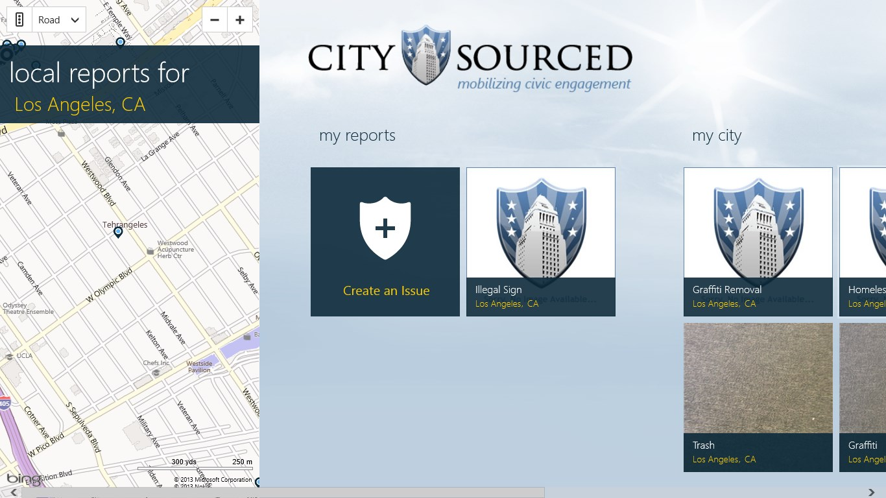
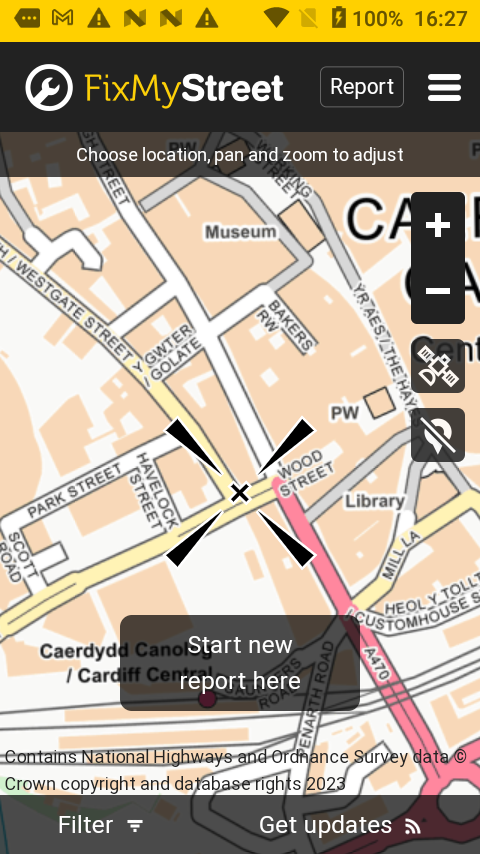
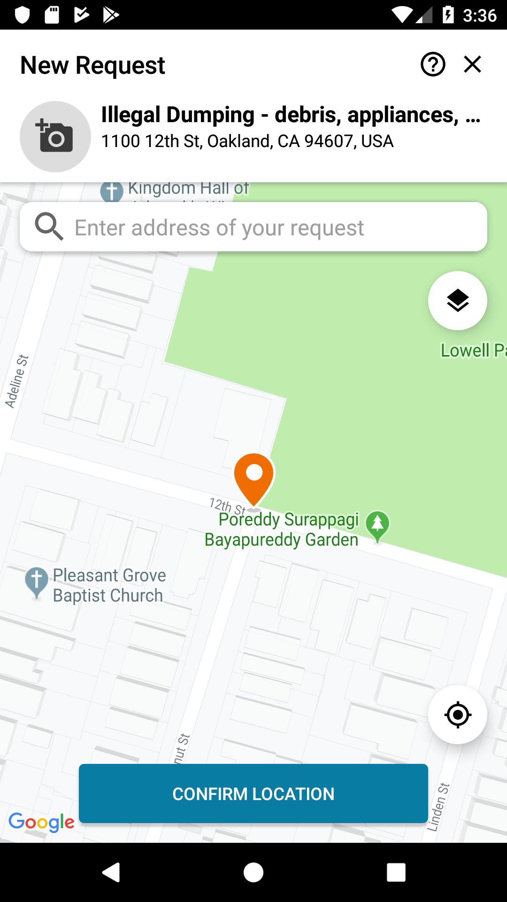
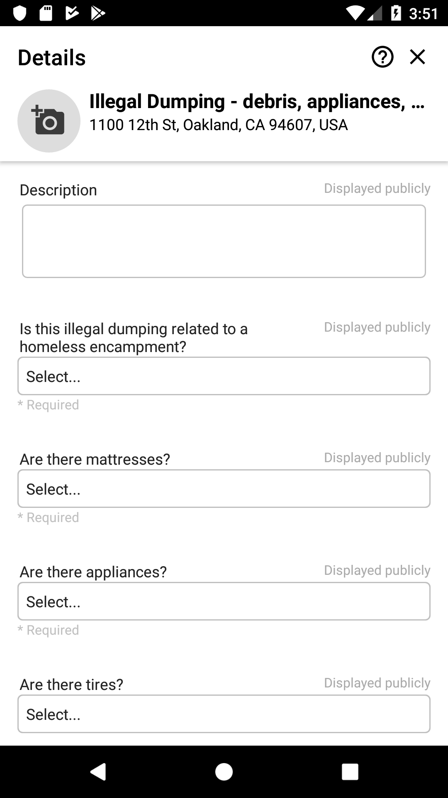
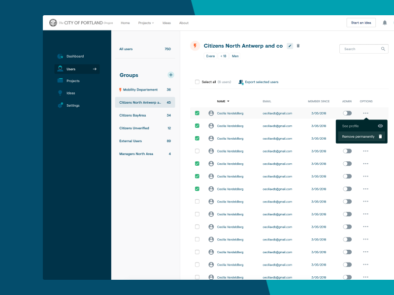
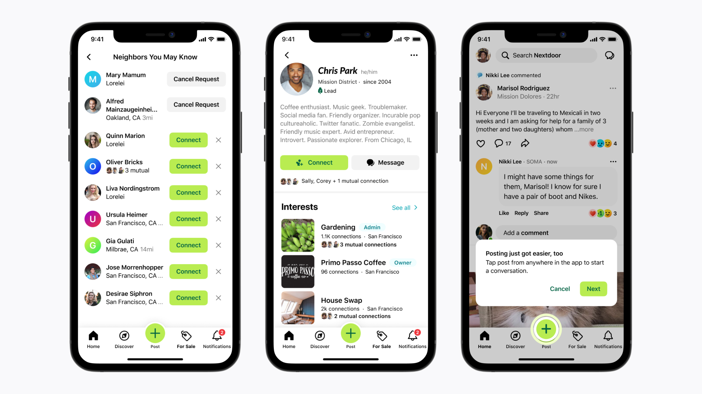
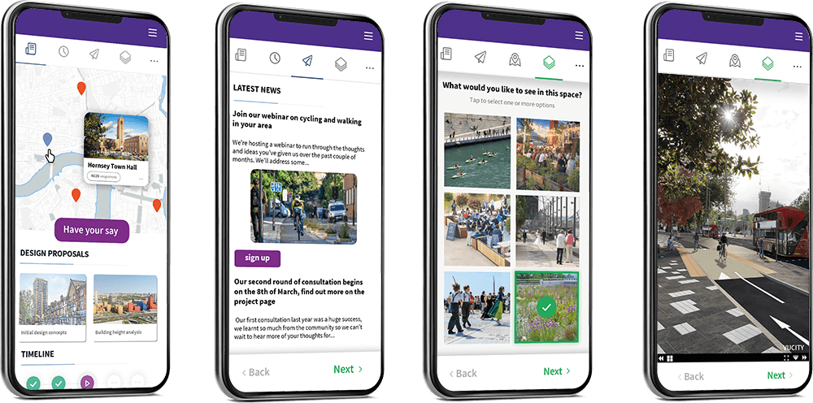
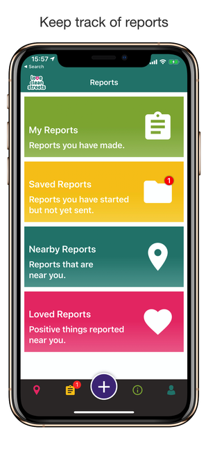

# Ferramentas
 - **API**: Springboot
 - **Mobile**: Flutter 

# Índice do Documento Técnico

## 1. Introdução
   - **1.1 Visão Geral do Projeto**: Breve descrição do aplicativo Smart City, propósito e público-alvo.
   - **1.2 Objetivos do Documento**: Explicitar o que o documento pretende abordar e os resultados esperados.

## 2. Análise de Mercado e Concorrentes
   - **2.1 Resumo do Mercado**: Panorama geral do mercado de aplicações para Smart Cities.
   - **2.2 Análise de Concorrentes**: 
      - Lista de concorrentes e suas funcionalidades principais.
      - Tabela comparativa com análise dos pontos fortes e fracos de cada aplicação.
      - Avaliação dos feedbacks dos utilizadores dessas plataformas.
   - **2.3 Proposta de Diferenciação**:
      - Funcionalidades inovadoras que podem ser implementadas, especialmente as que envolvem IA.
      - Melhorias e práticas a evitar com base nas análises feitas.

## 3. Personas e Visão do Produto
   - **3.1 Definição de Personas**:
      - Perfis detalhados de cada persona (ex.: cidadãos, funcionários públicos, gestores).
   - **3.2 Visão do Produto**:
      - Como o produto beneficia cada persona.
      - Objetivos de longo prazo e impacto para a cidade.

## 4. Proposta de Funcionalidades
   - **4.1 Funcionalidades Principais (Requisitos Funcionais)**:
      - Descrição de cada funcionalidade crítica do app (ex.: reporte de problemas, elogios, participação em eventos).
   - **4.2 Funcionalidades Inovadoras com IA**:
      - Explicação de como a IA será utilizada (ex.: relatórios automáticos, sugestões personalizadas, chatbot).
   - **4.3 Funcionalidades de Gamificação**:
      - Sistema de pontos, recompensas e mecânicas de engajamento.
   - **4.4 Requisitos Não Funcionais**:
      - Segurança, conformidade com GDPR, escalabilidade e desempenho.
   - **4.5 Casos de Uso (User Cases)**:
      - Cenários práticos de uso para cada funcionalidade.

## 5. Mecânicas de Gamificação
   - **5.1 Sistema de Pontos**:
      - Definição de como os utilizadores podem ganhar e gastar pontos.
   - **5.2 Recompensas**:
      - Exemplos de recompensas dentro da aplicação (insígnias, descontos) e incentivos externos (ex.: transporte público).
   - **5.3 Desafios e Metas**:
      - Exemplos de desafios para manter o engajamento (ex.: relatar problemas num determinado período).

## 6. Conceitualização da IA
   - **6.1 Relatórios Automáticos**:
      - Como a IA analisa fotos e gera relatórios de problemas automaticamente.
   - **6.2 Sugestões Personalizadas**:
      - Explicação do mecanismo de IA para recomendar eventos e serviços com base nos hábitos e localização do utilizador.
   - **6.3 Chatbot**:
      - Descrição do chatbot integrado, o seu fluxo de interação e como responde a problemas comuns.

## 7. Design Técnico
   - **7.1 Arquitetura do Sistema**:
      - Descrição detalhada da arquitetura geral, incluindo:
        - **Diagrama de Arquitetura de Alto Nível**: Mostra a interação entre a aplicação móvel, backend e IA.
        - **Diagrama de Componentes**: Descreve os módulos principais (ex.: frontend, backend, serviços de IA, base de dados, APIs).
   - **7.2 Estrutura da API**:
      - Definição dos principais endpoints da API e dos seus métodos (GET, POST, etc.).
      - **Diagrama de Sequência da API**: Mostra o fluxo de dados entre a aplicação e os serviços backend/IA.
   - **7.3 Design da Base de Dados**:
      - Definir o tipo de base de dados (relacional ou não-relacional).
      - **Modelo Entidade-Relacionamento (ER)**: Mostra as tabelas e as relações entre os dados.
      - Explicação de como os dados dos utilizadores, relatórios, elogios e pontos serão armazenados.

## 8. Requisitos Técnicos e Ferramentas
   - **8.1 Tecnologias Utilizadas**:
      - Linguagens de programação, frameworks e bibliotecas (ex.: React Native, Node.js, TensorFlow para IA).
   - **8.2 Contêineres e Orquestração**:
      - Uso de Docker para contêineres e Kubernetes para escalabilidade.
   - **8.3 Integração Contínua (CI) e Entrega Contínua (CD)**:
      - Ferramentas e práticas para automatizar testes e deploy (ex.: Git, Jenkins).

## 9. Planeamento e Gestão do Projeto
   - **9.1 Gestão de Versionamento**:
      - Uso de Git e boas práticas de versionamento (ex.: feature branching, pull requests).
   - **9.2 Ferramentas de Gestão de Projeto**:
      - Uso de ferramentas como JIRA ou Trello para gerir backlog, sprints e alocação de tarefas.

## 10. Considerações Finais
   - **10.1 Avaliação e Proximidade com o Investidor**:
      - Como o produto está alinhado com a visão do investidor.
   - **10.2 Potencial de Crescimento**:
      - Ideias para futuras expansões do produto e novas funcionalidades que podem ser adicionadas.

---

# Análise de Mercado e Concorrentes
**Objetivo**: Compreender os prós e contras de aplicativos concorrentes, identificar diferenciais para o nosso produto, adotar boas práticas e evitar erros observados.

### Passo a passo:
1. Identificar aplicações semelhantes e suas funcionalidades em comum, como reporte de problemas, elogios, etc. (ex.: SeeClickFix, CitySourced).
2. Listar as funcionalidades principais de cada aplicação.
3. Avaliar os concorrentes tanto sob a nossa perspectiva quanto pela avaliação dos clientes dessas aplicações.
4. Identificar funcionalidades que podem ser aprimoradas ou automatizadas com IA.

### Componentes:
- Resumo do mercado
- Tabela com análise de cada concorrente
- Proposta de diferenciação do nosso produto

---

# Personas e Visão do Produto
**Objetivo**: Definir os usuários principais e explicar como o produto beneficiará cada um.

### Passo a passo:
1. Definir as personas (cidadãos, funcionários públicos, gestores).
2. Descrever a visão do produto, focando nos benefícios para cada persona.

### Componentes:
- Descrição detalhada de cada persona (perfil demográfico, necessidades, como a aplicação vai ajudar)
- Visão do produto (como ele resolverá problemas e gerará valor)

---

# Proposta de Funcionalidades
**Objetivo**: Criar uma lista completa das funcionalidades do aplicativo, incluindo requisitos funcionais e não funcionais.

### Passo a passo:
1. Definir as **funcionalidades principais** (requisitos funcionais).
2. Propor **funcionalidades inovadoras**, especialmente aquelas que utilizarão IA.
3. Definir **funcionalidades de gamificação** para aumentar o engajamento.
4. Listar os **requisitos não funcionais** (ex.: segurança, escalabilidade).

### Componentes:
- Lista de funcionalidades com nome, breve descrição, público-alvo e prioridade
- Casos de uso (User cases)

---

# Mecânicas de Gamificação
**Objetivo**: Criar um sistema de pontos e recompensas para engajar os usuários.

### Passo a passo:
1. Definir o sistema de pontos (como ganhar e como gastar).
2. Estabelecer as recompensas baseadas nos pontos acumulados.
3. Criar desafios e metas que incentivem a participação contínua.

### Componentes:
- Estrutura de pontos
- Exemplos de ações e recompensas
- Descrição de desafios e metas

---

# Conceitualização da IA
**Objetivo**: Explicar como a IA será usada para melhorar a experiência do usuário.

### Passo a passo:
1. Gerar relatórios automáticos com base nas entradas dos usuários (ex.: análise de fotos).
2. Oferecer sugestões personalizadas baseadas no comportamento e localização do usuário.
3. Implementar um chatbot para auxiliar nas interações e respostas rápidas.

### Componentes:
- Explicação sobre como a IA será implementada e em quais áreas.

---

# Design Técnico
**Objetivo**: Definir a arquitetura do sistema e seus principais componentes.

### Passo a passo:
1. Desenhar a arquitetura geral do sistema (app, backend, IA).
2. Definir a estrutura da API e como os dados serão trocados entre frontend e backend.
3. Projetar o modelo de banco de dados (relacional ou não-relacional).

### Componentes:
- Diagrama da arquitetura do sistema
- Desenho da API (rotas principais e endpoints)
- Modelo de banco de dados (estruturas e relacionamentos)

# Detalhamento dos Componentes Técnicos:

### 1. Arquitetura do Sistema
   - **Diagrama de Arquitetura de Alto Nível**: Mostra a comunicação entre os componentes principais, como a aplicação móvel, serviços backend (relatórios, IA) e base de dados.
   - **Diagrama de Componentes**: Apresenta cada módulo do sistema, por exemplo:
     - **Frontend (aplicação móvel)**
     - **Backend (servidores que tratam requisições e dados)**
     - **IA (módulo para gerar relatórios automáticos e sugestões)**
     - **Base de Dados (armazenamento relacional e não-relacional)**

### 2. Estrutura da API
   - **Diagrama de Sequência da API**: Ilustra como os dados fluem entre a aplicação e os serviços backend, como por exemplo:
     - Requisição para reportar um problema → Backend valida e armazena → IA gera um relatório a partir da imagem → Envio de resposta para o utilizador.
   - Endpoints importantes:
     - **POST /reportar-problema**: Enviar um novo problema com imagem e descrição.
     - **GET /sugestoes-eventos**: IA sugere eventos locais para o utilizador.

### 3. Design da Base de Dados
   - **Modelo Entidade-Relacionamento (ER)**: Diagrama que mostra as tabelas (ou coleções) e as relações entre elas, como:
     - Tabela de **Utilizadores**: Armazena informações pessoais e pontuação.
     - Tabela de **Relatórios**: Regista os problemas reportados pelos cidadãos.
     - Tabela de **Elogios**: Regista os elogios aos serviços da cidade.
   - Definir o tipo de dados e relacionamentos (relacional ou não-relacional) e como cada um será armazenado.

# Plano de Desenvolvimento até 1 de Novembro

## Semana 1: 25 de setembro a 1 de outubro
### Objetivo: Pesquisa inicial e levantamento de informações
- **25/09 - 27/09**: 
  - Pesquisa de mercado e análise de concorrentes:
    - Identificar 3 a 5 aplicações concorrentes.
    - Recolher feedbacks e avaliações dos utilizadores dessas aplicações.
    - Analisar funcionalidades e tecnologias utilizadas.
  - Começar a escrever o **Resumo do Mercado** e a **Análise de Concorrentes**.
- **28/09 - 29/09**:
  - Definir **personas** (cidadãos, funcionários públicos, gestores).
  - Escrever a secção de **Personas** no documento.
- **30/09 - 01/10**: 
  - Definir a **Visão do Produto**, destacando o valor para cada persona.
  - Redigir a **Visão do Produto**.

## Semana 2: 2 de outubro a 8 de outubro
### Objetivo: Definir funcionalidades e requisitos
- **02/10 - 04/10**:
  - Definir as **funcionalidades principais** do aplicativo (requisitos funcionais).
  - Iniciar a redação da secção **Funcionalidades Principais**.
- **05/10 - 07/10**:
  - Definir as **funcionalidades inovadoras** com IA (relatórios automáticos, sugestões personalizadas, chatbot).
  - Redigir a secção **Funcionalidades Inovadoras**.
- **08/10**: 
  - Recolher exemplos de funcionalidades de **gamificação**.
  - Definir os **requisitos não funcionais** (segurança, escalabilidade, GDPR).

## Semana 3: 9 de outubro a 15 de outubro
### Objetivo: Desenvolver componentes técnicos e estrutura de gamificação
- **09/10 - 10/10**:
  - Definir o **sistema de pontos** e **recompensas** para a gamificação.
  - Redigir a secção de **Mecânicas de Gamificação**.
- **11/10 - 12/10**:
  - Definir os **desafios e metas** que incentivam o engajamento dos utilizadores.
  - Finalizar a secção de gamificação.
- **13/10 - 14/10**:
  - Começar a planear a **Arquitetura do Sistema**:
    - Estruturar o **Diagrama de Arquitetura de Alto Nível**.
    - Descrever os componentes principais (frontend, backend, IA, base de dados).
- **15/10**:
  - Iniciar a redação da secção **Arquitetura do Sistema**.

## Semana 4: 16 de outubro a 22 de outubro
### Objetivo: Detalhamento técnico (API e base de dados)
- **16/10 - 18/10**:
  - Definir a **estrutura da API**:
    - Detalhar os principais **endpoints** e as suas funcionalidades.
    - Criar o **Diagrama de Sequência da API**.
  - Redigir a secção **Estrutura da API**.
- **19/10 - 21/10**:
  - Definir o **modelo de base de dados** (relacional e não-relacional).
  - Criar o **Modelo Entidade-Relacionamento (ER)**.
- **22/10**:
  - Redigir a secção **Design da Base de Dados**.

## Semana 5: 23 de outubro a 29 de outubro
### Objetivo: Tecnologias, integração contínua e planeamento do projeto
- **23/10 - 24/10**:
  - Descrever as **tecnologias utilizadas** (React Native, Node.js, TensorFlow, etc.).
  - Redigir a secção **Requisitos Técnicos e Ferramentas**.
- **25/10 - 26/10**:
  - Definir como será feita a **containerização** (Docker, Kubernetes).
  - Redigir a secção **Contêineres e Orquestração**.
- **27/10 - 28/10**:
  - Definir as práticas de **Integração Contínua (CI)** e **Entrega Contínua (CD)**.
  - Redigir a secção de **CI/CD**.
- **29/10**:
  - Finalizar a secção de **Planeamento e Gestão do Projeto** (Git, JIRA).

## Semana 6: 30 de outubro a 1 de novembro
### Objetivo: Revisão final e considerações
- **30/10**:
  - Revisar todas as secções anteriores e assegurar a consistência no conteúdo.
- **31/10**:
  - Redigir a secção **Considerações Finais**:
    - Avaliação da proximidade do produto com a visão do investidor.
    - Potencial de crescimento futuro do produto.
- **01/11**:
  - Fazer uma revisão final do documento, corrigir eventuais erros e preparar a entrega.

---

## Resumo de Tarefas por Semana:
- **Semana 1**: Pesquisa de mercado, análise de concorrentes, personas e visão do produto.
- **Semana 2**: Funcionalidades principais, funcionalidades com IA, gamificação e requisitos não funcionais.
- **Semana 3**: Sistema de gamificação, arquitetura do sistema.
- **Semana 4**: Estrutura da API, design da base de dados.
- **Semana 5**: Tecnologias, containerização, integração contínua.
- **Semana 6**: Revisão geral, considerações finais, ajustes finais e entrega.

---

# Análise de Concorrência

# Aplicações de *Smart Cities* para Reportar Incidentes e Criar Eventos

## 1. CitySourced
- **Função Principal**: Permite que os cidadãos reportem incidentes, como buracos nas ruas, lixo, problemas em infraestruturas públicas, etc.
- **Outras Funcionalidades**: A aplicação oferece notificações em tempo real para que os utilizadores possam acompanhar o estado do incidente reportado, desde a submissão até à resolução. Também permite que os cidadãos enviem fotografias e vídeos para complementar os relatórios, garantindo maior precisão. O sistema inclui uma funcionalidade de feedback pós-resolução, onde os cidadãos podem avaliar o atendimento e a eficácia da resposta.
- **IA**: Sim. Utiliza IA para categorizar os relatórios e priorizar o encaminhamento para os departamentos corretos.
- **Gamificação**: Sim. O sistema atribui pontos aos cidadãos com base no número de relatórios feitos e na sua precisão.
- **Plataforma**: Mobile (iOS, Android).

## 2. FixMyStreet
- **Função Principal**: Focada no reporte de problemas em ruas e áreas públicas, como lixo, buracos, iluminação defeituosa, etc. Disponível em várias cidades em todo o mundo.
- **Outras Funcionalidades**: O FixMyStreet permite que os utilizadores anexem fotografias para ilustrar os problemas reportados. Oferece um mapa interativo que ajuda na localização precisa dos incidentes, facilitando a identificação geográfica pelos departamentos municipais. Além disso, é possível acompanhar o estado dos problemas reportados, garantindo transparência no processo de resolução.
- **IA**: Não há informações sobre uma ferramenta de IA associada.
- **Gamificação**: Não. A aplicação não inclui gamificação no seu design.
- **Plataforma**: Mobile (iOS, Android) e Web.

## 3. SeeClickFix
- **Função Principal**: Permite que os cidadãos reportem problemas locais, como infraestrutura danificada, lixo, e até crimes menores. As autoridades podem responder directamente aos relatórios.
- **Outras Funcionalidades**: A aplicação permite integração com redes sociais, possibilitando que os cidadãos partilhem problemas reportados nas suas contas pessoais. O SeeClickFix disponibiliza mapas interativos para acompanhar o progresso dos problemas reportados em tempo real, além de permitir conversas públicas entre cidadãos e autoridades, aumentando a transparência. Os relatórios podem incluir imagens, vídeos e descrições detalhadas.
- **IA**: Sim. Utiliza IA para ajudar na triagem e encaminhamento dos relatórios aos departamentos certos, além de prever o impacto dos problemas reportados.
- **Gamificação**: Sim. Atribui pontos por cada problema reportado e resolve problemas com base na localização, incentivando a contribuição contínua.
- **Plataforma**: Mobile (iOS, Android) e Web.

## 4. CitizenLab
- **Função Principal**: Embora focada em consultas e envolvimento público, permite que cidadãos sugiram e criem eventos, além de discutir políticas públicas e participar em decisões da cidade.
- **Outras Funcionalidades**: O CitizenLab oferece uma plataforma de envolvimento inclusiva, onde os cidadãos podem criar e votar em inquéritos, além de sugerir propostas para políticas públicas. A aplicação também permite a criação de fóruns de discussão, onde os utilizadores podem debater assuntos locais em grupo. O mapeamento visual das ideias facilita a navegação por temas e áreas de interesse. É uma ferramenta ideal para promover debates e transparência em decisões governamentais.
- **IA**: Sim. Utiliza IA para analisar as contribuições dos cidadãos e fornecer insights às autoridades.
- **Gamificação**: Não há um sistema claro de gamificação implementado.
- **Plataforma**: Web, mas também tem versões adaptadas para dispositivos móveis.

## 5. Nextdoor
- **Função Principal**: Principalmente uma rede social de vizinhança, permite que cidadãos reportem questões locais e organizem eventos como festivais, feiras e atividades comunitárias.
- **Outras Funcionalidades**: Além de ser uma plataforma de comunicação entre vizinhos, o Nextdoor inclui uma funcionalidade de mercado, onde os moradores podem vender, trocar ou doar itens. A aplicação também possui uma secção de segurança pública, onde os utilizadores podem partilhar alertas sobre crimes ou atividades suspeitas na região. O Nextdoor envia notificações com base na localização para manter os utilizadores informados sobre eventos e notícias locais relevantes.
- **IA**: Sim. Utiliza IA para moderar conteúdos e melhorar a experiência do utilizador, identificando automaticamente tópicos relevantes e priorizando atualizações locais.
- **Gamificação**: Não há gamificação directa, mas os utilizadores recebem reconhecimento social com base nas suas contribuições.
- **Plataforma**: Mobile (iOS, Android).

## 6. Commonplace
- **Função Principal**: Projetada para envolvimento comunitário, permite que cidadãos contribuam com ideias, reportem problemas locais e organizem eventos na comunidade.
- **Outras Funcionalidades**: O Commonplace oferece ferramentas para as autoridades locais criarem consultas públicas detalhadas e visualizações de dados sobre as respostas da comunidade. Facilita a comunicação bidirecional, permitindo que tanto cidadãos como administradores partilhem feedback. A plataforma também oferece opções para organizar discussões públicas online e permite a criação de painéis de visualização de projectos locais.
- **IA**: Sim. Utiliza IA para analisar grandes volumes de dados e fornecer relatórios detalhados para a administração pública.
- **Gamificação**: Não há um sistema de gamificação explícito.
- **Plataforma**: Web e Mobile.

## 7. Love Clean Streets
- **Função Principal**: Focada em relatórios sobre limpeza urbana, como lixo, grafitis e vandalismo, onde cidadãos podem enviar fotografias e descrições.
- **Outras Funcionalidades**: O Love Clean Streets oferece a possibilidade de os cidadãos incluírem geolocalização nas fotografias enviadas, permitindo que os serviços municipais localizem e resolvam os problemas de forma mais rápida. Os utilizadores podem acompanhar o estado das suas solicitações e participar em campanhas organizadas pelas autoridades para melhorar a limpeza das áreas urbanas.
- **IA**: Não há menção de IA nas funcionalidades principais.
- **Gamificação**: Sim. A aplicação inclui sistemas de pontos e classificação de utilizadores com base nas suas contribuições.
- **Plataforma**: Mobile (iOS, Android).

## 8. MyCivic
- **Função Principal**: Permite que os cidadãos reportem problemas locais e organizem eventos como workshops, festivais e encontros comunitários. O foco é em fornecer uma plataforma para comunicação entre residentes e governos locais.
- **Outras Funcionalidades**: Além de permitir o reporte de incidentes, o MyCivic facilita a comunicação direta entre os cidadãos e os departamentos governamentais para pedidos de serviços. A aplicação também oferece suporte para o agendamento de compromissos e a realização de pagamentos de taxas municipais, como multas e serviços de água ou saneamento. Inclui um sistema de notificações personalizadas, alertando os utilizadores sobre eventos locais e atualizações importantes.
- **IA**: Sim. Integra IA para análise de dados e priorização de relatórios.
- **Gamificação**: Não há sistema de gamificação.
- **Plataforma**: Mobile (iOS, Android) e Web.

## Análise das Interfaces da Concorrência

1. **Estilo Visual:**
   - **Modernos**: *CitizenLab, Commonplace, SeeClickFix, NextDoor*. Estes têm designs mais atualizados, geralmente com elementos gráficos como mapas e foco na participação ativa.
   - **Funcionais e Simples**: *CitySourced, LoveCleanStreets, FixMyStreet, MyCivic*. Estes têm uma interface minimalista, focada na ação direta e rápida, sem muitos elementos visuais extra.

2. **Layout e Organização:**
   - **Centrados em Mapas**: *SeeClickFix, FixMyStreet* têm mapas interativos como o principal meio de navegação, facilitando a visualização e reporte de problemas com uma localização precisa.
   - **Centrados em Ações Rápidas**: *CitySourced, LoveCleanStreets, MyCivic* foram desenhados para reportar problemas de forma direta, com menus simples e ícones grandes.
   - **Envolvimento Cívico e Social**: *CitizenLab, Commonplace* focam mais em interações comunitárias e participação em projetos. *NextDoor* tem um layout semelhante a uma rede social para promover a comunicação entre vizinhos.

3. **Usabilidade:**
   - **Reportes Fáceis e Rápidos**: *FixMyStreet, SeeClickFix, LoveCleanStreets, CitySourced, MyCivic* são altamente eficientes para utilizadores que pretendem reportar um problema rapidamente com o mínimo de passos.
   - **Participação Comunitária**: *CitizenLab, Commonplace* têm uma usabilidade orientada para uma contribuição mais prolongada em debates, votações ou feedback comunitário. *NextDoor* oferece uma alta usabilidade no contexto social, especialmente para utilizadores já familiarizados com o formato de rede social.

4. **Funcionalidades Principais:**
   - **Mapas Interativos e Reportes**: *SeeClickFix e FixMyStreet* focam-se principalmente em permitir que os utilizadores reportem problemas urbanos e visualizem relatórios existentes num mapa.
   - **Engajamento Comunitário e Cívico**: *CitizenLab e Commonplace* incentivam a participação em questões locais, votações e discussões sobre projetos de desenvolvimento.
   - **Redes Sociais Locais**: *NextDoor* oferece uma plataforma social para comunicação entre vizinhos, troca de informações e discussões em fóruns.
